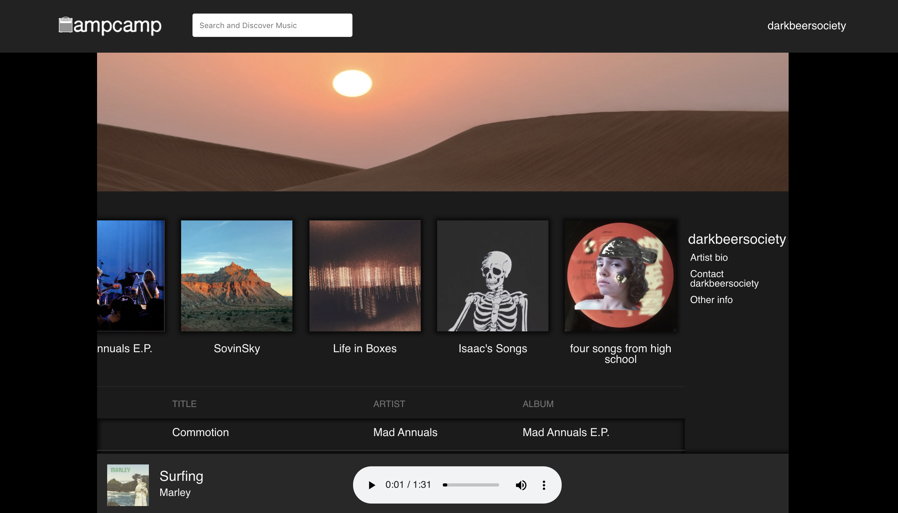
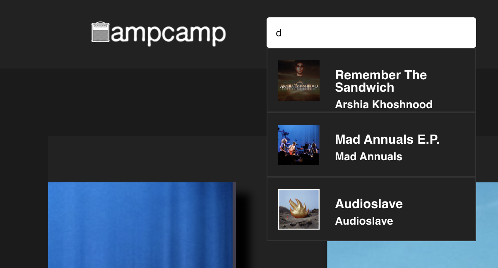
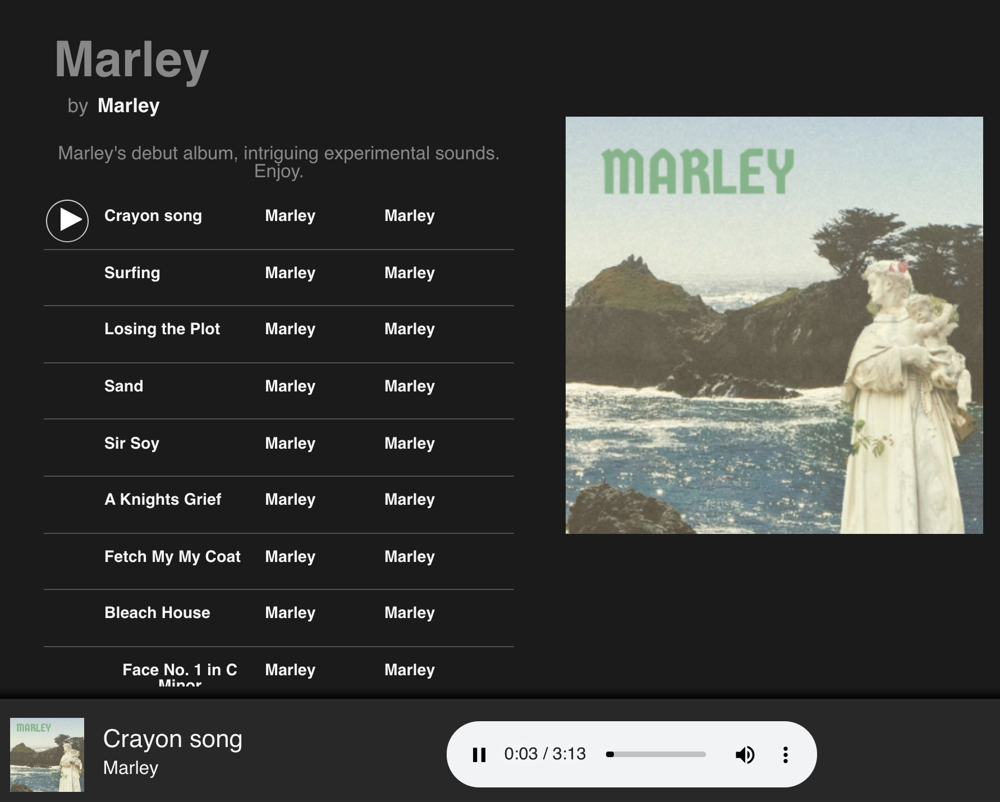

# [AmpCamp](https://ampcamp.herokuapp.com/#/)

AmpCamp is a heavy-metal themed music-sharing site where users can stream, and download music. Users primarily sign up as "listeners", but they can also sign up as "artists" if they intend to upload music of their own. 

AmpCamp is built with **ExpressJS, MongoDB, and Apollo GraphQL/React on the frontend.** Photos and audio files are stored on **Amazon Web Services (AWS).**

## Features

   **Album Upload**
   
- Users that sign up as "artists" have the ability to upload songs/albums to AmpCamp
- On the album-upload page, users can create an album with a cover photo, a name, and a description. Users can alias the artist name on the album (it defaults to their username), and they can attach as many audio files (songs) as they would like. 
- Album upload page features a live preview of the album, displaying the cover photo, name, description, and list of songs. This updates in real time with user input. 
- Upon uploading the album, AmpCamp awaits the AWS file uploads (displaying a loading bar in the mean time), and then redirects to the current user's artist-show page so that they can view their newly-uploaded album. All of this makes for a seamless and intuitive UX/UI.

   **Search**

- AmpCamp uses a backend regex search to allow users to search for albums and artists. 
- Search suggestions are displayed in a dynamic drop-down consisting of links to respective artist and albums. 

   **Audio Player**
   
- AmpCamp features an audio player component in a fixed bottom nav so users can listen to music from anywhere in the app.
- Audio player moves as you scroll so it's easy to play/pause songs

