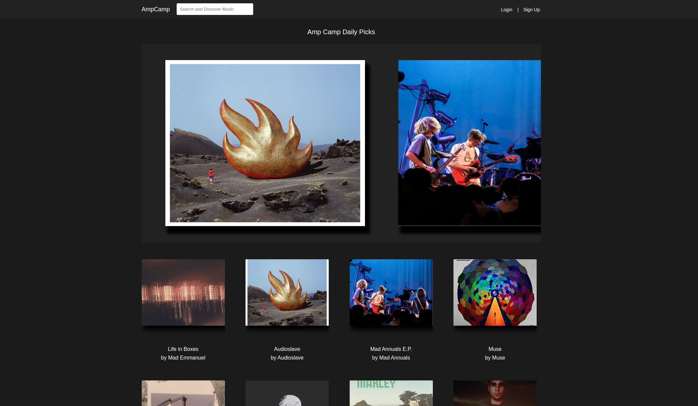

# AmpCamp
BandCamp clone -- BandCamp clone that allows users to sign up as artists or as listeners, an artist has the ability to upload an album which will upload multiple songs at once. A user can browse different artists music through the featured artists page and also can download and browse music from different albums

https://ampcamp.herokuapp.com/#/

# Features
    * New account creation, login, and guest login
    * Artist can upload an album, containing multiple songs
    * Ability to browse a discover popular albums and songs through featured artists
    * Listeners can download music through the audio player
    * Artist have complete control over the banner photo they upload, their song titles, and their album covers that they upload
    * Search - ability to search for users and albums

# Project Design

AmpCamp was designed and built in 1 week and 2 days. 

A proposal was drafter with a schema, sample state, and backend/frontend routes to guide/outline the process

# Implementation

Passwords are secured using BCrypt to generate a passord_digest. A user session_token is stored in the database to keep track of each user session. When a user successfully logs in, a session token is generated, stored in the database, and stored on the client-side as a browser cookie.

### Artist Sign Up

Users has the ability to sign up as a listener or as an artist, only an artist has the ability to upload albums and songs to the database. 

### Album Upload

Artists have the ability to upload albums that contain multiple tracks. Upon successful upload the artist will be redirected to their artist show page to display their new album. 

### Artist Show

Artists have a show page which houses all of their albums and all of their songs. You can listen to all of their songs through the artist show page, and also check out the album show page where just those albums songs are held.  

### Search

A user can search for albums or artist that they want to find, the search bar will distinguish between an artist and an album when you click the link and navigate to that page

### Coming Features

There were a couple of features we wanted to implement that we didn't get the chance to, they are as follows.

    * Discover filter page which has genre tags that we can browse
